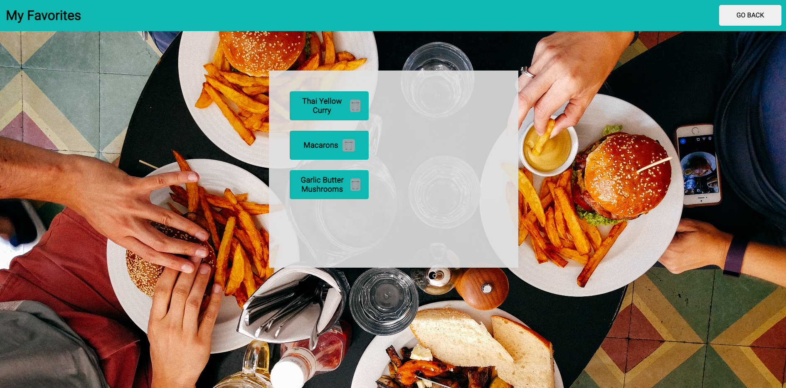

# What's for Dinner? 

### Abstract:
This application helps the user pick a dish to make. Anyone you stuggles to come up with ideas or make decisions can be beifited by this app. They can track their favorite ideas for future reference.

### Installation Instructions:
1. Fork and clone this repo.
2. Type `cd whats-for-dinner` to move into the root directory
3. Open the webpage by typing `open index.html`

### Preview of App:

### Context:
This project for Turing Mod 1 Front End students took me about 15 hours. Much of that time was spent getting the hang of CSS.

### Contributors:
Renee Pinna: https://github.com/reneepinna

### Learning Goals:
The goal was to learn how to build a website to comp with HTML, CSS, and JavaScript. Additionally, I learned how to use local storage for this project, giving users the ability to keep their favorites.

### Wins + Challenges:
The CSS component on this project was by far the most challenging for me. I found that it was often unpredicatble for me and required a lot of tinkering to get right. Each time I finally got an element to the size and place I wanted it I was absolutely delighted. 

A big win for me was getting local storage to work. It ended up being far easier than I was expecting. I am so excited to apply it in future projects.
